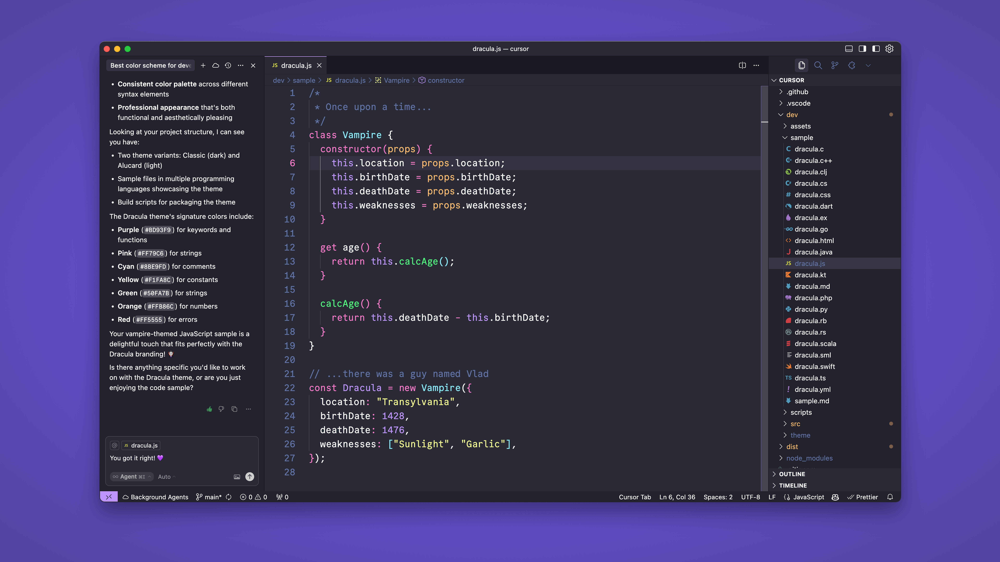

# Dracula for [Foobar](https://foobar.com)

> A dark theme for [Foobar](https://foobar.com).

## Install

All instructions can be found at [draculatheme.com/foobar](https://draculatheme.com/foobar).

## Team

This theme is maintained by the following person(s) and a bunch of [awesome contributors](https://github.com/dracula/foobar/graphs/contributors).

|  |  |
| ---------------------------------------------------------------------------------------- | --------------------------------------------------------------------------------------------- |
| [Zeno Rocha](https://github.com/zenorocha)                                               | [Lucas de França](https://github.com/luxonauta)                                               |

## Community

Join thousands of vampires using Dracula Theme around the world 🦇

- [X (Twitter)](https://x.com/draculatheme) and [Instagram](https://www.instagram.com/draculatheme) - Follow for tips, news, and fun.
- [Discord](https://draculatheme.com/discord-invite) - Hang out and chat with the rest of the clan.
- [GitHub Discussions](https://github.com/dracula/dracula-theme/discussions) - Ask questions and discuss issues.

## Dracula PRO

## License

[MIT License](./LICENSE)
